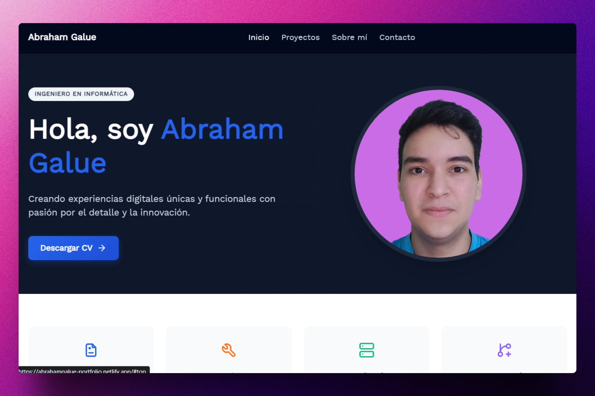
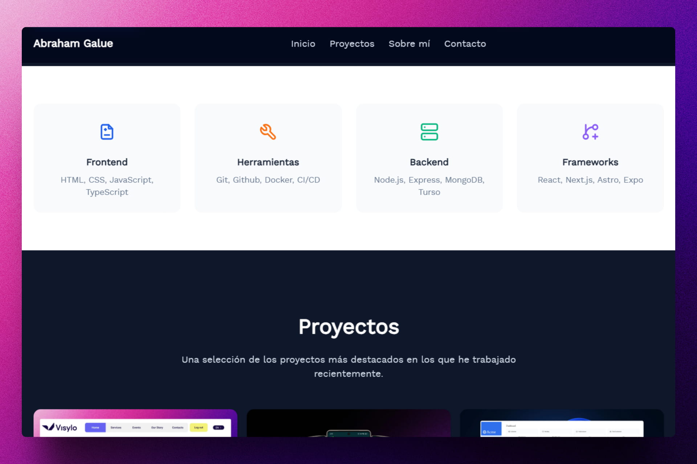
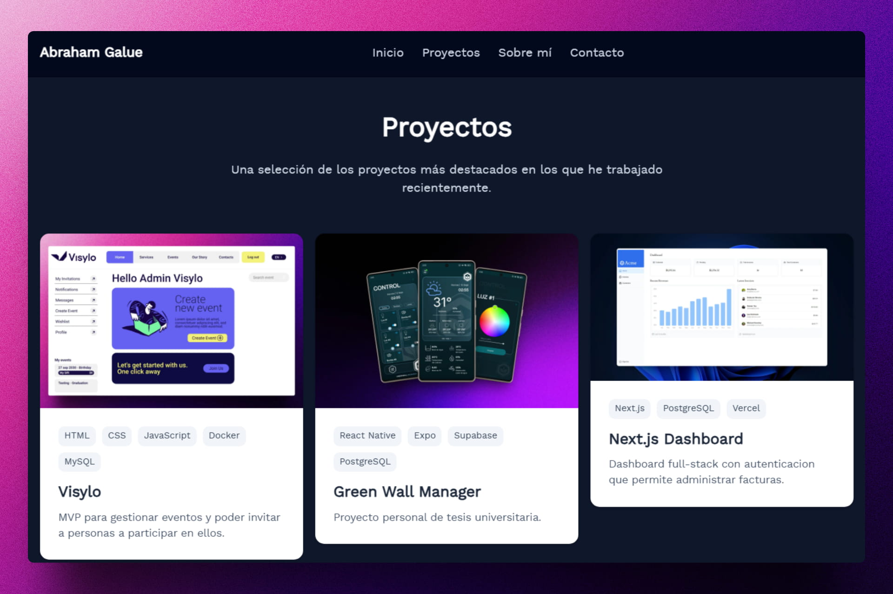

<div align='center'>

# 🚀 Astro: Personal Portfolio

</div>

### Portafolio personal.

> 🧩 Aquí puedes ver su [**Live Demo**](https://abrahamgalue-portfolio.netlify.app/).







## 🚀 Descripción

Este proyecto es un portafolio personal desarrollado con **Astro**, diseñado para mostrar mis habilidades, proyectos y experiencia de manera profesional y atractiva.

El portafolio incluye secciones como **Sobre mí**, **Proyectos**, **Habilidades** y **Contacto**, proporcionando una visión completa de mi perfil profesional.

## ⚡ Comenzar

### Prerrequisitos

1. Git.
2. Node.js 20 o superior.
3. pnpm (opcional, puedes usar npm o yarn).

## 🔧 Instalación

### Usando pnpm

1. **Clona el repositorio:**

   ```bash
   git clone https://github.com/abrahamgalue/portfolio.git
   cd portfolio
   ```

2. **Instala las dependencias:**

   ```bash
   pnpm install
   ```

3. **Inicia el servidor de desarrollo:**

   ```bash
   pnpm dev
   ```

4. **Abre tu navegador y visita:**

   ```bash
   http://localhost:4321
   ```

## 🎭 Tecnologías

- [**Astro**](https://astro.build/) Framework para construir sitios web rápidos.
